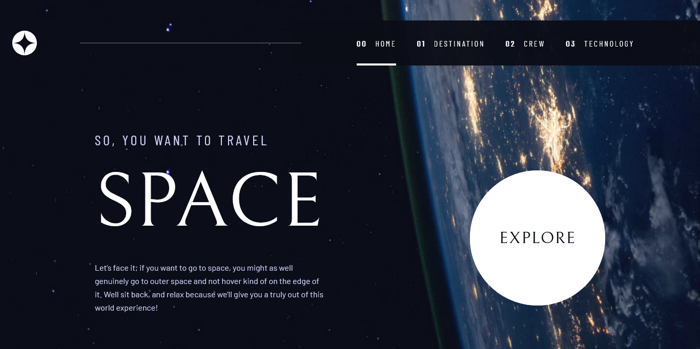

# Frontend Mentor - Space tourism website solution

This is a solution to the [Space tourism website challenge on Frontend Mentor](https://www.frontendmentor.io/challenges/space-tourism-multipage-website-gRWj1URZ3). Frontend Mentor challenges help you improve your coding skills by building realistic projects.

## Table of contents

- [Overview](#overview)
  - [The challenge](#the-challenge)
  - [Screenshot](#screenshot)
  - [Links](#links)
- [My process](#my-process)
  - [Built with](#built-with)
  - [What I learned](#what-i-learned)
  - [Continued development](#continued-development)
  - [Useful resources](#useful-resources)
- [Author](#author)
- [Acknowledgments](#acknowledgments)

## Overview

Space tourism is a website made to learn about the universe we live in and apparently for my to practice my design coding skills

### The challenge

1. The Grid system for some of the pages
2. Navbar not Rerendering on every page because it inherits backgroud from each pages
3. Working strickly with the design system
4. Rendering different sizes of a image on different screen sizes

Users should be able to:

- View the optimal layout for each of the website's pages depending on their device's screen size
- See hover states for all interactive elements on the page
- View each page and be able to toggle between the tabs to see new information

### Screenshot



### Links

- Solution URL: [Github Repo](https://github.com/Hassan-Ib/space-tourism)
- Live Site URL: [space-tourism-ib-netlify.app](https://space-tourism-ib.netlify.app)

## My process

### Built with

- Semantic HTML5 markup
- CSS custom properties
- Flexbox
- CSS Grid
- Mobile-first workflow
- [React](https://reactjs.org/) - JS library
- [tailwind css](https://tailwindcss.com/) - For styles

### What I learned

```html
<!-- image art direction -->
<picture>
  <source srcset="image 1 landscape" media="(max-width:1024px)" />
  <source srcset="image 2 portrait" media="(min-width:1020px)" />
  
</picture>
```

```Typescript

```

### Continued development

- Looking to add animation to the tabs

### Useful resources

- [MDN](https://developer.mozilla.org/) - Look up image Art direction from this resource, I gotta tell it well written and explained

**Note: Delete this note and replace the list above with resources that helped you during the challenge. These could come in handy for anyone viewing your solution or for yourself when you look back on this project in the future.**

## Author

- Website - [Hassan Ibrahim](https://hassan-ib.vercel.app)
- Frontend Mentor - [@Hassan-Ib](https://www.frontendmentor.io/profile/Hassan)
- Twitter - [@Azanebrahim](https://www.twitter.com/SilverTongue)

## Acknowledgments

- [Frontend Mentor](https://www.frontendmentor.io/) for providing this resource to learn from
- [Haybuka](https://github.com/Haybuka), my good friend, for suggesting I try this one out
